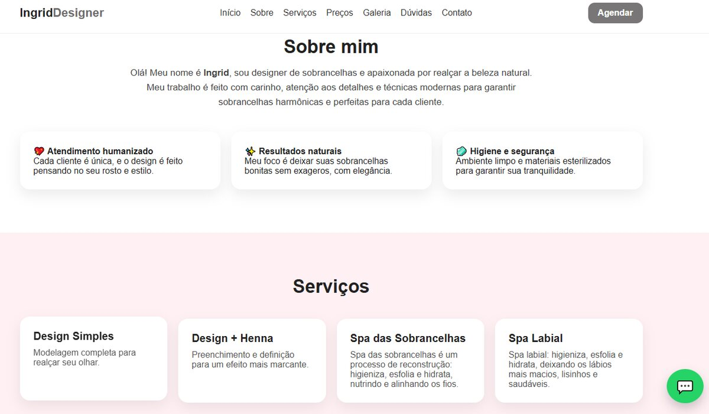
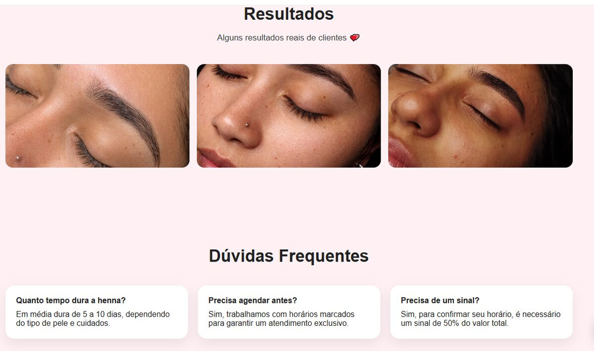

<div align="center">

# Ingrid Lash Art

Landing page responsiva para apresentação de serviços de design de sobrancelhas, divulgação de resultados e agendamento pelo WhatsApp.

[](https://developer.mozilla.org/pt-BR/docs/Web/HTML)
[](https://developer.mozilla.org/pt-BR/docs/Web/CSS)
[](https://developer.mozilla.org/pt-BR/docs/Web/JavaScript)

[Visualizar o site](https://ingrid-site-eosin.vercel.app)

</div>

## Sobre o projeto

O site foi desenvolvido para fortalecer a presença digital de uma profissional da área da beleza. A página reúne informações sobre os serviços, valores, resultados, dúvidas frequentes e canais de contato em uma experiência simples e adaptada para diferentes tamanhos de tela.

## Funcionalidades

- Layout responsivo para computador, tablet e celular
- Menu de navegação com acesso rápido às seções
- Apresentação dos serviços e tabela de preços
- Galeria com resultados reais
- Seção de dúvidas frequentes
- Animações durante a rolagem da página
- Botões de contato e agendamento pelo WhatsApp
- Formulário que monta automaticamente a mensagem do cliente

## Tecnologias utilizadas

- **HTML5** para a estrutura da página
- **CSS3** para estilização, responsividade e animações
- **JavaScript** para o menu móvel, formulário e interações
- **Vercel** para publicação do site

## Capturas de tela

### Página inicial


### Apresentação e serviços



### Resultados e dúvidas frequentes



## Como executar

1. Clone este repositório:

```bash
git clone https://github.com/isaquelimaporto/ingrid-Lashart.git
```

2. Entre na pasta do projeto:

```bash
cd ingrid-Lashart
```

3. Abra o arquivo `index.html` no navegador.

Não é necessário instalar dependências.

## Estrutura do projeto

```text
ingrid-Lashart/
├── Img/
├── docs/
│   └── images/
├── index.html
├── script.js
├── style.css
└── README.md
```

## Autor

Desenvolvido por **Isaque Lima Porto**.

[Perfil no GitHub](https://github.com/isaquelimaporto)
